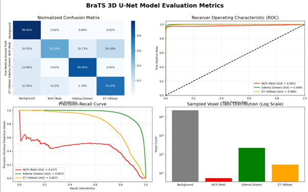
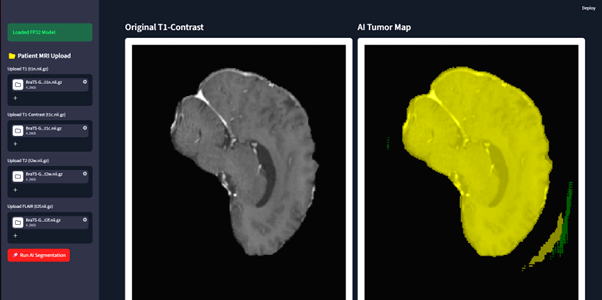

# 🧠 3D Brain Tumor Segmentation (BraTS)


An end-to-end deep learning pipeline for 3D volumetric medical image segmentation, trained on the BraTS dataset. This project utilizes a **3D U-Net** architecture to process multi-modal MRI scans ($T1$, $T1c$, $T2$, $FLAIR$) and predict three distinct tumor sub-regions.

Developed as an advanced deep learning implementation within the Robotics and Artificial Intelligence engineering curriculum at Thapar Institute of Engineering and Technology, this project bridges the gap between theoretical computer vision and clinical deployability.

## 🌟 Project Highlights

* **Architecture:** 3D U-Net implemented via MONAI, designed to capture spatial context across full MRI volumes rather than isolated 2D slices.
* **Loss Function:** Custom Combined Focal + Dice Loss to combat severe class imbalance, specifically targeting the microscopic voxel volume of the Necrotic Core.
* **Hardware & Memory Optimization:** 
  * Engineered a resilient "Data Shield" `DataLoader` to automatically bypass corrupted patient NIfTI files during training.
  * Implemented PyTorch Automatic Mixed Precision (AMP), reducing VRAM consumption and epoch training time by over 30% on consumer hardware.
* **Clinical UI:** Interactive web frontend built with Streamlit for real-time, in-browser MRI inference. Optimized with explicit garbage collection to run safely within strict 1GB RAM deployment limits.

## 📊 Model Performance & Metrics (Epoch 32)
The model was trained utilizing an Early Stopping algorithm, reaching optimal convergence at **Epoch 32**. It was evaluated using multi-class ROC, Precision-Recall curves, and normalized confusion matrices.

| Tumor Sub-Region | Validation AUC | Precision (PR-AUC) |
| :--- | :--- | :--- |
| **Necrotic Core (NCR)** | **0.981** | 0.437 |
| **Peritumoral Edema (ED)** | **0.999** | 0.957 |
| **Enhancing Tumor (ET)** | **0.996** | 0.807 |



## 🔍 Explainable AI & Error Analysis
To ensure clinical trust and transparency, the pipeline includes an XAI module to prove the network relies on pathological features rather than background artifacts.

### Tumor Detection Saliency Map
The model successfully isolates the contrast-enhancing borders in the MRI data, aligning its attention seamlessly with clinical ground truth.
%20Saliency%20Map.png)

### Deep-Dive Error Analysis (Depth Slice 58)
A granular voxel-level evaluation of False Positives (Hallucinations) and False Negatives (Misses), demonstrating that the AI's volumetric predictions align near-perfectly with expert annotations.
.png)

## 🖥️ Streamlit Frontend
Upload 4 NIfTI (`.nii.gz`) modalities to generate an AI-powered tumor boundary map in seconds. 


*(Legend: 🔴 Necrotic Core | 🟢 Peritumoral Edema | 🟡 Enhancing Tumor)*

## 🚀 Quick Start

**1. Clone the repository and install dependencies:**
```bash
git clone [https://github.com/YOUR_GITHUB_USERNAME/YOUR_REPO_NAME.git](https://github.com/YOUR_GITHUB_USERNAME/YOUR_REPO_NAME.git)
cd YOUR_REPO_NAME
pip install -r requirements.txt